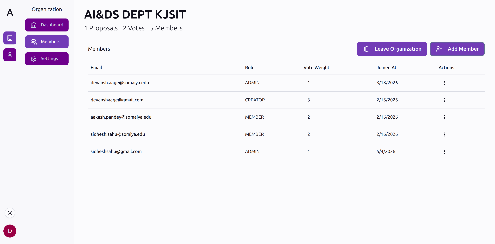
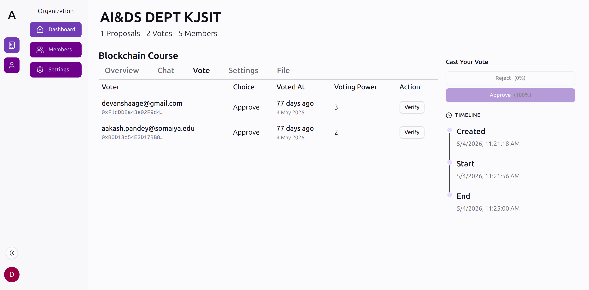
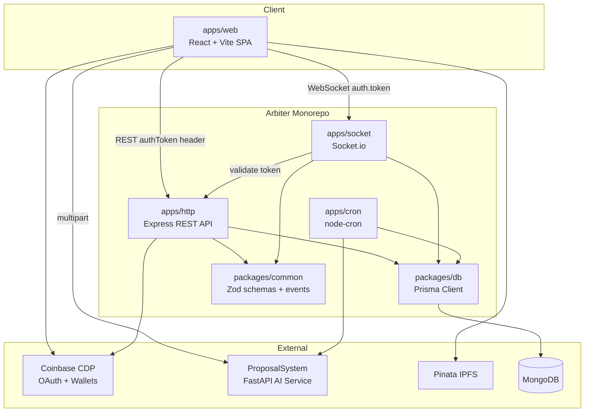

# Arbiter

**AI-assisted, wallet-verified governance for organizations.**

Arbiter helps teams, communities, and organizations run structured proposal workflows with accountable voting. Members sign in with Google, receive an EVM smart wallet via Coinbase Developer Platform (CDP), and cast cryptographically signed votes in real time. The companion [ProposalSystem](https://github.com/sidheshsahu/ProposalSystem) AI service evaluates proposals against organizational context, generates summaries, and powers per-proposal chat.


## Screenshots

Create organizations, manage members, upload proposals, review documents, chat with AI, and cast wallet-verified votes.

| | |
|:---:|:---:|
| **Create organization** | **Members & roles** |
|  |  |
| **Upload proposal** | **Proposal document** |
|  |  |
| **AI proposal chat** | **Vote & verify** |
|  |  |

---

## About

Modern groups — DAOs, clubs, co-ops, product councils — need more than a chat thread to make decisions. Arbiter provides a full governance loop: create an organization, upload proposal documents, debate with AI-assisted context, vote with wallet signatures, and verify results independently.

Each organization has a **bias profile** per member — free-text context the AI uses to evaluate how well a proposal aligns with the group's values. Proposals move through a lifecycle (`UPCOMING` → `ACTIVE` → `COMPLETED` / `CLOSED`), with a background cron service finalizing results when deadlines pass.

Voting is **transparent** today: every ballot is tied to a member's wallet, signed with their CDP-provisioned key, and broadcast live over WebSockets. The data model also includes Semaphore identity commitments and anonymous vote fields, laying groundwork for privacy-preserving voting in a future release.

### Related repository

Arbiter is the **frontend and backend** of the governance platform. The **AI layer** lives in a separate repo:

| Repository | Role |
|------------|------|
| [Devansh-Aage/Arbiter](https://github.com/Devansh-Aage/Arbiter) (this repo) | React SPA, Express API, Socket.io voting, cron worker |
| [sidheshsahu/ProposalSystem](https://github.com/sidheshsahu/ProposalSystem) | FastAPI AI service — RAG, bias evaluation, summarization, chat |

---

## Features

- **Google OAuth + smart wallets** — Sign in via Coinbase CDP; EVM accounts are provisioned automatically for vote signing
- **Multi-organization membership** — Create orgs, invite members by email, assign roles (`CREATOR`, `ADMIN`, `MEMBER`)
- **Weighted voting** — Per-member vote weight (1–100)
- **Proposal lifecycle** — Upload documents (IPFS via Pinata), set choices and deadlines, track status through completion
- **AI proposal evaluation** — Acceptance prediction, bias evaluation, and recommendations ([ProposalSystem](https://github.com/sidheshsahu/ProposalSystem))
- **AI-generated summaries** — Per-member pros/cons, vote suggestions, and reasoning
- **Real-time voting** — Live vote tallies over Socket.io with wallet-signed ballots
- **Vote verification** — Independently verify any vote's ECDSA signature against the voter's wallet
- **Proposal chat** — Context-aware Q&A with AI responses on each proposal
- **Admin controls** — Close or delete proposals, edit org settings, manage admins and member weights
- **Semaphore groundwork** — Identity commitments stored per org for future anonymous voting

---

## Architecture

Arbiter is a **pnpm + Turborepo monorepo** with four apps and two shared packages.



### Auth flow

1. User signs in with Google via CDP on the web app.
2. The frontend sends the CDP access token as an `authToken` header on HTTP requests.
3. HTTP middleware validates the token with the CDP SDK and upserts the user (email + wallet) in MongoDB.
4. The Socket server validates the same token by calling `GET /api/app/auth` on the HTTP service.
5. Votes are emitted over Socket.io, persisted with the member's signature and weighted vote value.

### Components

| Layer | Responsibility |
|-------|----------------|
| `apps/web` | React SPA — routing, CDP hooks, TanStack Query, Pinata uploads, socket client |
| `apps/http` | Express REST API — orgs, proposals, discussions, chat messages |
| `apps/socket` | Real-time vote ingestion and proposal room management |
| `apps/cron` | Deadline monitoring, result finalization, org-context AI refresh |
| `packages/db` | Prisma schema, generated client, shared database types |
| `packages/common` | Zod validation schemas and socket event constants |

---

## Tech Stack

| Layer | Technology |
|-------|------------|
| Monorepo | pnpm workspaces, Turborepo |
| Language | TypeScript ~5.9 |
| Frontend | React 19, Vite 7, React Router 7, TanStack Query 5 |
| UI | Tailwind CSS 4, shadcn/ui (Radix), Lucide, Sonner |
| Backend API | Express 5, CORS, express-rate-limit |
| Real-time | Socket.io 4 |
| Scheduled jobs | node-cron |
| Database | MongoDB via Prisma 6 |
| Auth / wallets | Coinbase CDP (`@coinbase/cdp-hooks`, `@coinbase/cdp-sdk`) |
| Signing / verify | viem, `@coinbase/cdp-core` |
| Privacy (partial) | Semaphore Protocol (`@semaphore-protocol/identity`, `group`) |
| File storage | Pinata (IPFS) |
| AI | [ProposalSystem](https://github.com/sidheshsahu/ProposalSystem) — FastAPI, Haystack RAG, Pinecone, Groq |
| Validation | Zod 4 |

---

## Project Structure

```
arbiter/
├── apps/
│   ├── web/          # React SPA (default: http://localhost:5173)
│   ├── http/         # Express REST API
│   ├── socket/       # Socket.io vote server
│   └── cron/         # Proposal deadline cron worker
├── packages/
│   ├── db/           # Prisma schema + client (@arbiter/db)
│   └── common/       # Shared Zod schemas + socket events (@arbiter/common)
├── package.json      # Root scripts (dev, build, db commands)
├── pnpm-workspace.yaml
└── turbo.json
```

---

## Prerequisites

- **Node.js** 18+ (Node 20+ recommended)
- **pnpm** `10.28.1` (enforced via `packageManager` in root `package.json`)
- **MongoDB** — Atlas cluster or self-hosted instance
- **Coinbase CDP** — Project with API key pair
- **Pinata** — Account with JWT and gateway URL
- **[ProposalSystem](https://github.com/sidheshsahu/ProposalSystem)** — FastAPI AI service for proposal creation and AI features (separate repo)

---

## Getting Started

### 1. Clone and install

```bash
git clone https://github.com/Devansh-Aage/Arbiter.git
cd arbiter
pnpm install
```

### 2. Configure environment variables

Create `.env` files in the locations below. Variable names are listed in the [Environment Variables](#environment-variables) section.

| File | Purpose |
|------|---------|
| `packages/db/.env` | Database connection |
| `apps/http/.env` | CDP keys, HTTP port, CORS |
| `apps/socket/.env` | WebSocket port, HTTP URL for auth, CORS |
| `apps/cron/.env` | FastAPI URL, cron port |
| `apps/web/.env` | Vite-prefixed frontend variables |

### 3. Set up the database

```bash
pnpm generate   # Generate Prisma client
pnpm push       # Push schema to MongoDB
```

### 4. Start the AI service

Clone and run the companion AI service from [sidheshsahu/ProposalSystem](https://github.com/sidheshsahu/ProposalSystem):

```bash
git clone https://github.com/sidheshsahu/ProposalSystem.git
cd ProposalSystem
pip install -r requirements.txt
# Create .env with GROQ_API_KEY and MONGO_URI (same MongoDB as Arbiter)
uvicorn app.server:app --reload
```

Point `VITE_FASTAPI_URL` (web) and `FASTAPI_URL` (cron) at the running service. Required endpoints:

| Endpoint | Purpose |
|----------|---------|
| `POST /bias-evaluate` | Create proposal and run bias check |
| `POST /evaluate` | Acceptance prediction |
| `POST /chat-evaluate` | AI chat replies |
| `POST /generate-org-context` | Post-deadline org context update |

See the [ProposalSystem README](https://github.com/sidheshsahu/ProposalSystem#api-endpoints) for full API documentation.

### 5. Run development servers

In separate terminals (or use `pnpm dev` to run all via Turborepo):

```bash
pnpm dev:web      # Frontend  → http://localhost:5173
pnpm dev:http     # REST API
pnpm dev:socket   # WebSocket server
pnpm start:cron   # Cron worker
```

Optional — open Prisma Studio:

```bash
pnpm studio
```

---

## Environment Variables

### `packages/db`

| Variable | Description |
|----------|-------------|
| `DATABASE_URL` | MongoDB connection string |

### `apps/http`

| Variable | Description |
|----------|-------------|
| `CDP_API_KEY_ID` | Coinbase CDP API key ID |
| `CDP_API_KEY_SECRET` | Coinbase CDP API secret |
| `HTTP_PORT` | HTTP server port |
| `FRONTEND_URL` | CORS origin (default `http://localhost:5173`) |

### `apps/socket`

| Variable | Description |
|----------|-------------|
| `WS_PORT` | WebSocket server port |
| `FRONTEND_URL` | Socket.io CORS origin |
| `HTTP_URL` | Base URL for auth validation — must include the `/api` prefix (e.g. `http://localhost:<HTTP_PORT>/api`) |
| `NODE_ENV` | Controls error verbosity in vote handler |

### `apps/cron`

| Variable | Description |
|----------|-------------|
| `PORT` | Cron service HTTP port (default `3001`) |
| `FASTAPI_URL` | AI service base URL |
| `DATABASE_URL` | MongoDB connection string |

### `apps/web` (must be prefixed with `VITE_`)

| Variable | Description |
|----------|-------------|
| `VITE_HTTP_URL` | REST API base (e.g. `http://localhost:<HTTP_PORT>/api/`) |
| `VITE_WS_URL` | Socket.io server URL |
| `VITE_CDP_PROJECT_ID` | Coinbase CDP project ID |
| `VITE_FASTAPI_URL` | AI service base URL |
| `VITE_PINATA_JWT` | Pinata API JWT |
| `VITE_PINATA_GATEWAY_URL` | Pinata gateway domain |


---

## Development Commands

| Command | Description |
|---------|-------------|
| `pnpm install` | Install all workspace dependencies |
| `pnpm dev` | Run all `dev` tasks via Turborepo |
| `pnpm dev:web` | Start Vite dev server |
| `pnpm dev:http` | Start Express API with nodemon |
| `pnpm dev:socket` | Start Socket.io server |
| `pnpm start:cron` | Start cron worker |
| `pnpm build` | Build all packages |
| `pnpm generate` | Run `prisma generate` for `@arbiter/db` |
| `pnpm push` | Run `prisma db push` (schema → MongoDB) |
| `pnpm migrate` | Run `prisma migrate dev` |
| `pnpm studio` | Open Prisma Studio |

---

## API Overview

### HTTP routes (`apps/http`)

| Prefix | Endpoints |
|--------|-----------|
| `/api/auth` | `GET /user` |
| `/api/org` | Create, list, members, bias, description, roles, vote-weight, admin management |
| `/api/proposal` | List by org, get, user-choice, close, chat, vote table, delete |
| `/api/discussion` | Create, vote, list by proposal |
| `/api/app` | `GET /auth` (socket auth bridge) |

---

## License

[Learning Use Only (LUO-1.0)](LICENSE) — personal, non-commercial learning only. Commercial use requires permission from the copyright holder.
